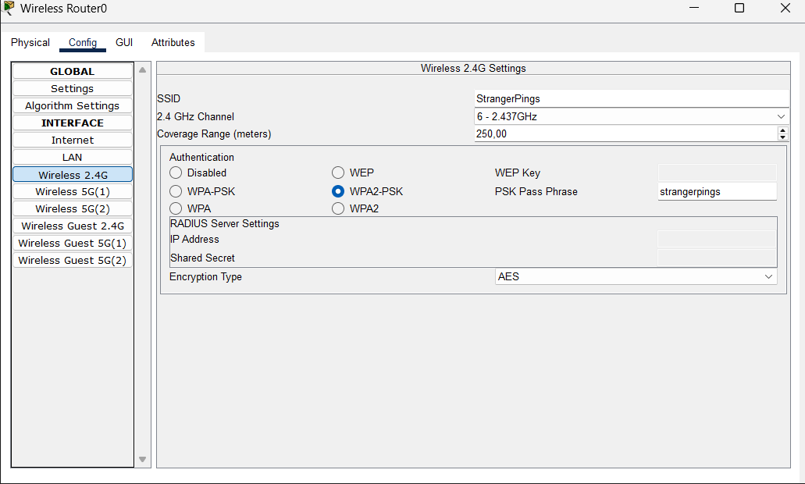
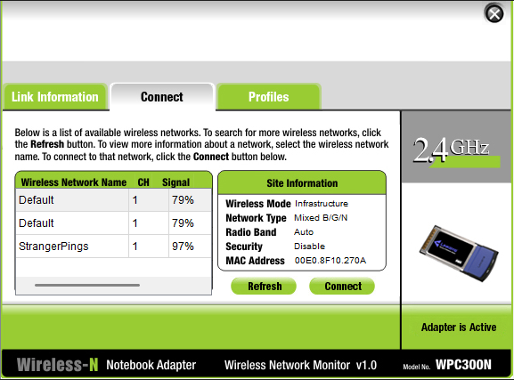
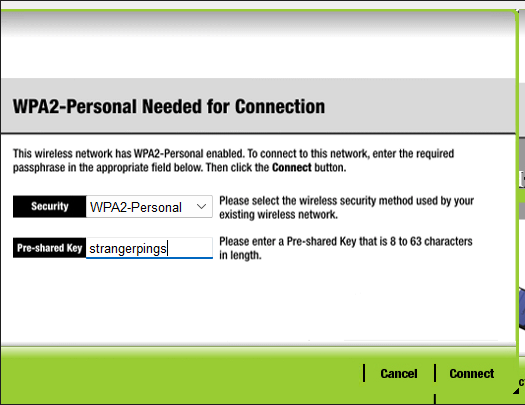
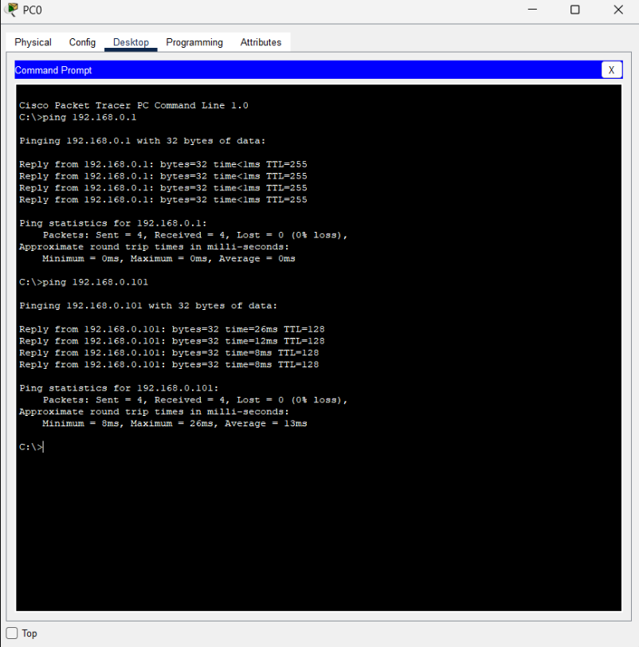
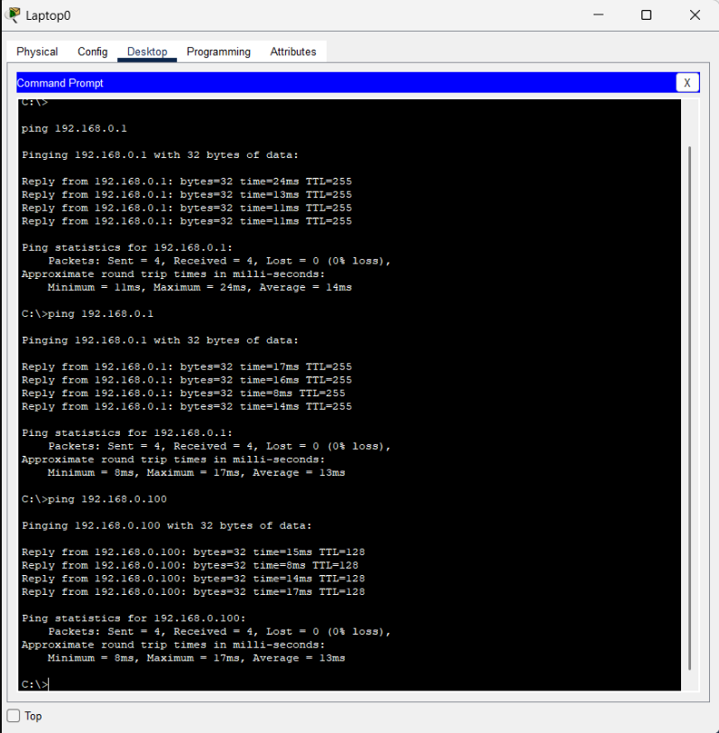
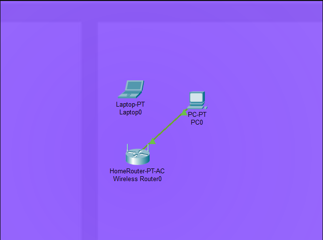

# Trabajo Práctico N°1

- **Santiago Alasia**
- **Lucia Feiguin Malkoni**
- **Elena Monutti**

**Stranger Pings**  
**Universidad Nacional de Córdoba** 
**Comunicaciones de Datos** 
**Santiago Martin Henn**  
**Miguel Ángel Solinas** 
**25/08/2025**

---

### Información de los autores
 
- **Información de contacto**: santiago.alasia@mi.unc.edu.ar 
- **Información de contacto**: lucia.feiguin@mi.unc.edu.ar
- **Información de contacto**: elena.monutti@mi.unc.edu.ar

---

## Resumen

En la primera parte del trabajo se analizaron los conceptos básicos de las ondas electromagnéticas, determinando frecuencia, longitud de onda y su ubicación en el espectro, junto con la identificación de dispositivos que operan en dicha banda. Se evaluaron fenómenos asociados a la propagación de señales y su influencia en distintas tecnologías de comunicación, así como el funcionamiento de señales digitales en esquemas de transmisión simples. Estos análisis permitieron comprender las limitaciones de transmitir señales escalonadas de manera inalambrica y sentaron las bases para el estudio de tecnicas de modulación y la implementación práctica en Packet Tracer. 

---

## Introducción

El presente trabajo de laboratorio tiene como objetivo repasar los fundamentos escenciales de las Comunicaciones Digitales, incluyendo ondas electromagneticas, señales en tiempo continuo y discreto, y conceptos de modulación y demodulación. Además se utilizó la herramienta Packet Tracer para comprender el diseño y análisis de redes de comunicación.

## Desarrollo

### 1. Resumen breve de fundamentos básicos y escenciales

- Ondas electromagnéticas.

 Son perturbaciones que se propagan en el espacio, formadas por campos eléctricos y magnéticos que oscilan de mandera perpendicular entre sí y a la dirección de propagación. No requieren un medio material, por lo que pueden transmitirse incluso en el vacío. Están caracterizadas por su longitud de onda y su frecuencia.

- Modulación.

Es el proceso mediante el cual una señal de información (de baja frecuencia) se combina con una señal portadora de alta frecuencia, para su transmisión a través de un medio.

- Demodulación.

Es el proceso inverso a la modulación, se realiza en el receptor para recuperar la señal de información original a partir de la señal modulada recibida.

- Señales de tiempo continuo.

Son aquellas cuya variable independiente, generalmente el tiempo (*t*), puede tomar cualquier valor real dentro de un intervalo, formando un dominio continuo.

- Señales de tiempo discreto.

Son señales representadas por una secuencia de valores definidos únicamente en instantes de tiempo específicos, en lugar de en cada momento posible.

**b)** Considerando que esta onda viaja exactamente a la velocidad de la luz, tenemos:
- Longitud de onda: $ \lambda = 60mm = 0,06m $
- Frecuencia: $f = \frac{c}{\lambda} = \frac{3.10^8}{0,06} = 5 GHz$

**c)** Esta onda electromagnética, al tener una frecuencia de 5 GHz, opera en la banda SHF (Super High Frequency), ya que la misma abarca el rango de frecuencias de 3 a 30 GHz.

**d)** Uno de los dispositivos para comunicaciones que opera en esta banda son, por ejemplo, los bucles locales inalámbricos (WLL - Wireless Local Loop), los cuales están diseñados específicamente para proveer acceso de telefonía y transmisión de datos (internet, voz, fax) entre el abonado y la central, reemplazando el par de cobre por un enlace radioeléctrico.

**e)** Con la línea de trazos roja en la figura se representa la atenuación de la onda. Este fenómeno demuestra como, a medida que la onda se propaga, su intensidad va disminuyendo con la distancia. Esto sucede porque parte de la energía se dispersa o se pierde, lo que provoca un decrecimiento prograsivo de la amplitud.

**f)** El fenómeno de la atenuación sí afecta a los bucles locales inalámbricos, porque la señal de radio que conecta al abonado con la estación base pierde intensidad con la distancia y los obstáculos. Un ejemplo cotidiano de esto es cuando, en una zona rural, se usa WLL para acceder a telefonía o internet. Si la vivienda está muy lejos de la torre o hay árboles o lluvia intensa, la señal se debilita y se pueden notar cortes en la comunicación o baja velocidad de conexión.

**g)** 
- i) La atenuación sí afecta a las transmisiones de telefonía celular, ya que provoca una pérdida de intensidad a la señal a medida que viaja por el espacio o atraviesa obstáculos tales como edificios, árboles o paredes. Esto puede reducir la calidad de la comunicación, generar interferencias o incluso pérdida de la conexión si la señal llega demasiado débil al receptor.

- ii) Las transmisiones por cable coaxial también se ven afectadas por la atenuación, en este tipo de transmisiones la señal se debilita por la resistencia del conductor y las pérdidas en el aislamiento, especialmente en largas distancias, lo que obliga a usar amplificadores.

- iii) En las transmisiones por fibra óptica, la atenuación es mucho menor que en otros medios, y se produce principalmente por absorción y dispersión de la luz dentro de la fibra, requiriendo en enlaces muy extensos el uso de regeneradores ópticos.

### 2. Comunicación de Datos
**a)** En la figura podemos observar dos señales: una de datos y otra de reloj. Este coneccion corresponde a una comunicación serial síncrona, en la cual la señal de reloj es utilizada por el receptor para muestrear los bits de datos en los instantes correctos, garantizando que la información sea interpretada de manera confiable. Además, vemos una sola línea de datos que va desde un módulo al otro, es decir, se trata de una comunicaion simplex.

**b)** Una de las principales ventajas de la comunicación síncrona es su alta velocidad, ya que no requiere el envío de bits adicionales para sincronizar los equipos. Pero al tratarse de una comunicación en modo simplex, no es la mejor opcion para una transmisión bidireccional. En este caso, lo mejor sería implementar un esquema half-duplex o un sistema full-duplex.

**c)** En este caso, se desea transmitir el símbolo ‘a’, cuya codificación en ASCII corresponde al byte 01100001. A partir de esta representación binaria, es posible deducir la forma que adoptará la señal durante la transmisión.

  

  

    <em>Figura 1: Codificación ASCII del carácter 'a'.</em>

  

**d)** Para determinar el valor de la señal, se debe realizar la medición en el centro de la celda de cada bit. En el caso de la figura mostrada más abajo, la muestra debería tomarse en el instante de tiempo correspondiente a T4. De esta manera, se garantiza que el valor de la señal en cada celda sea el correcto.

  

  

    <em>Figura 2: Momento de muestreo de la señal.</em>

  

### 3.
**a)**

**b)**
  

  

    <em>Figura 3: Modulación PSK.</em>

  

**c)**

**d)**

### 4.

Para este punto lo primero que se hizo fue colocar un router inalambrico desde la categoría **Wireless Devices** en el area de trabajo del Packet Tracer, que servirá como el nodo central de la red. 
Luego, se configuró el Router según los datos establecidos en la consigna: 

- IP address: 192.168.0.1
- Subnet Mask: 255.255.255.0
- SSID: StrangerPings
- Authentication: WPA2-PSK
- Password: strangerpings

  

  

    <em>Figura 4: Panel de Configuración de la red Wireless.</em>

  

Como podemos ver en la imagen, el router inalámbrico opera en la frecuencia de 2.437 GHz, correspondiente al canal 6 en la banda de 2.4 GHz. Esta frecuencia se encuentra dentro de la región de microondas del espectro electromagnético y pertenece a la banda ISM (Industrial, Scientific and Medical), de uso no licenciado a nivel mundial. Esta banda la usan tecnologías como WiFi, Bluetooth y algunos dispositivos de uso cotidiano, lo que explica la posibilidad de interferencias entre equipos que comparten el mismo rango. 

Luego, se agregó una PC de escritorio y se conectó al router mediante un cable de cobre recto. La configuración de red se realizó en modo DHCP, permitiendo que la PC obtuviera automáticamente una dirección de IP válida dentro de la red. En este caso, dicha dirección es: 192.168.0.100

Se incorporó una notebook y se le instaló una tarjeta de red inalámbrica. Posteriormente, se conectó a la red WiFi configurada en el router ingresando la clave WPA2 definida previamente.
La dirección IP de la laptop definida por DHCP es: 192.168.0.101

  

  

    <em>Figura 5: Panel de coneccion a la red Wireless.</em>

  

  

  

    <em>Figura 6: Panel de Login de la red Wireless.</em>

  

Se realizaron pruebas de conectividad entre los dispositivos mediante la herramienta de diagnóstico *ping*. Los resultados confirmaron la comunicación bidireccional entre la PC y la notebook, así como con el router. Esto validó el correcto funcionamiento de la red configurada y la coherencia en la asignación de direcciones IP. 

Pruebas en la PC de escritorio

  

  

    <em>Figura 7: Pruebas de coneccion en la PC.</em>

  

Pruebas en la Laptop 

  

  

    <em>Figura 8: Pruebas de coneccion en la Laptop.</em>

  

Por último, en la vista física se analizó la cobertura de la señal Wifi. Cuando la notebook se encontraba en la zona violeta (area de propacación), la comunicación se mantuvo estable. Al mover el dispositivo fuera de la cobertura, el enlace se perdió y no fue posible establecer conexión, lo que permitió obsevar el alcance y limitaciones de la señal inalámbrica

  

  

    <em>Figura 9: Área de Alcance de la red Wireless.</em>

  

---

## Discusión Y Conclusiones

---

## Referencias

Stallings, W. (2004). Comunicaciones y redes de computadoras (7.ª ed.). Pearson Education.

