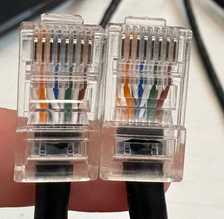
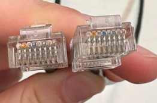
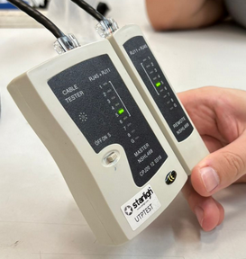
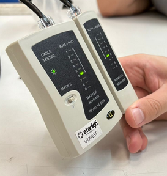
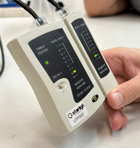
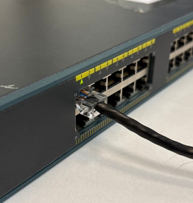
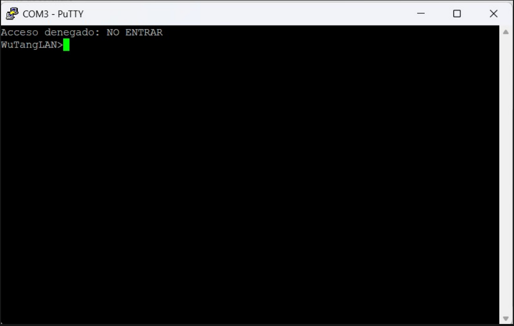
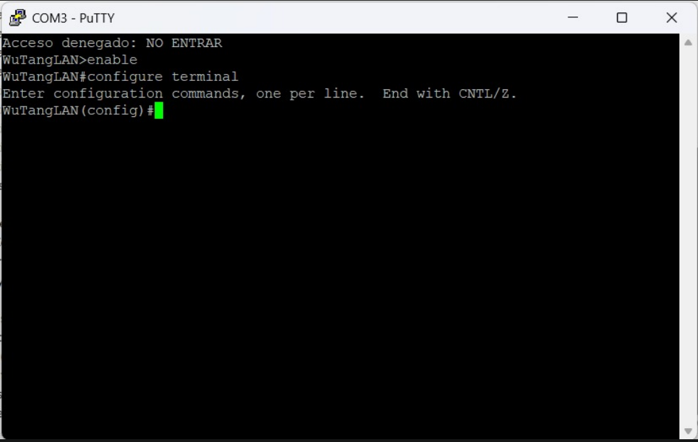
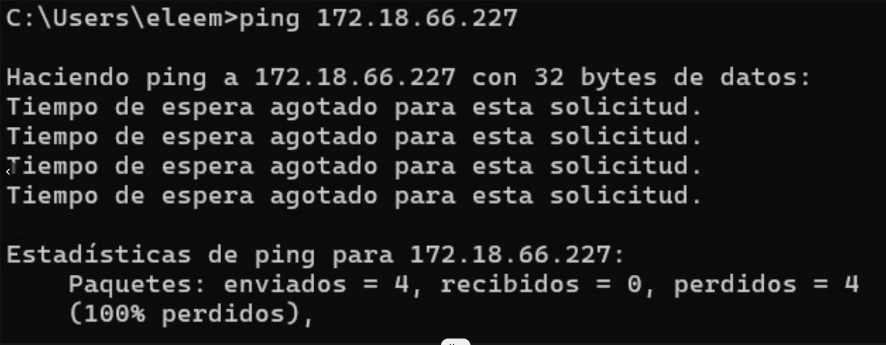

# Trabajo Práctico N°2

- **Santiago Alasia**
- **Lucia Feiguin Malkoni**
- **Elena Monutti**

**Stranger Pings**  
**Universidad Nacional de Córdoba** 
**Redes de Computadoras** 
**Santiago Martin Henn**  
**Facundo Nicolas Oliva Cuneo** 
**02/04/2026**

---

### Información de los autores
 
- **Información de contacto**: santiago.alasia@mi.unc.edu.ar 
- **Información de contacto**: lucia.feiguin@mi.unc.edu.ar
- **Información de contacto**: elena.monutti@mi.unc.edu.ar

---

## Resumen

---

## Introducción

---

## Desarrollo

### Parte 1: Armado y Verificación de cables Cat5/Cat5e bajo estandar T568A/B

Se logró armar el cable bajo la norma T568A/B con éxito y sin compplicaciones, siguiendo las instrucciones recibidas por parte del profesor y de los tutoriales brindados en la consigna. Luego se intercambiaron cables con otro grupo, y se realizó la siguiente instección para verificar el correcto funcionamiento del cable:

1. Inspección visual: Se revisó que los conductores estuvieran correctamente alineados, que llegaran hasta el fondo del conector y que la cubierta externa estuviera correctamente prensada.

2. Verificación eléctrica: Se utilizó un tester de cables Ethernet para comprobar la continuidad de cada uno de los 8 hilos. El resultado esperado fue una correspondencia directa entre los pines de ambos extremos (1-1, 2-2, ..., 8-8), confirmando la correcta construcción del cable.

En conclusión, el cable funcionó correctamente, por lo que podemos afirmar que fue adecuadamente armado.

### Parte 2: Equipamiento físico, verificación y utilización de equipos de red y análisis de tráfico.

Se trabajó con un switch Cisco Catalyst 2950, el cual es un dispositivo de capa 2 utilizado para la interconexión de equipos dentro de una red local (LAN).

**Características principales del switch:**

- 24 puertos Fast Ethernet (10/100 Mbps)
- Soporte para VLANs
- Administración mediante interfaz de línea de comandos (CLI)
- Puerto de consola para configuración inicial
- Soporte de protocolos de red como STP (Spanning Tree Protocol)

**Acceso a la consola del switch**

Para acceder al switch se utilizó el software PuTTY, configurado con los siguientes parámetros:

- Velocidad: 9600 baudios
- Bits de datos: 8
- Paridad: ninguna
- Bits de parada: 1
- Control de flujo: ninguno

Se conectó la PC al puerto de consola del switch mediante un cable serie a RJ-45, logrando acceso a la interfaz de configuración.

**Configuración básica**

Una vez iniciada la sesión, se accedió al modo privilegiado mediante el comando enable y posteriormente al modo de configuración global utilizando configure terminal, tal como se observa en la evidencia experimental.

En este punto, el equipo quedó listo para recibir comandos de configuración. Sin embargo, no se realizaron modificaciones adicionales sobre el dispositivo (como cambio de contraseñas o configuración de parámetros de red), limitándose la práctica a verificar el acceso correcto a la interfaz de configuración.

**Conexión de equipos y pruebas de conectividad**

---

## Discusión Y Conclusiones
