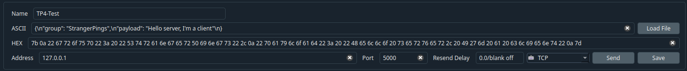
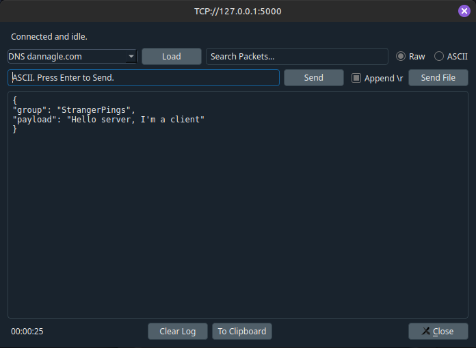
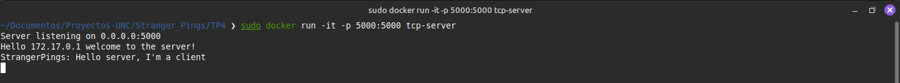

# Trabajo Práctico N°4

- **Santiago Alasia**
- **Lucia Feiguin Malkoni**
- **Elena Monutti**

**Stranger Pings** </br>
**Universidad Nacional de Córdoba**</br>
**Redes de Computadoras**</br>
**Santiago Martin Henn** </br>
**Facundo Nicolas Oliva Cuneo**</br>
**20/05/2026**

---

### Información de los autores
 
- **Información de contacto**: santiago.alasia@mi.unc.edu.ar 
- **Información de contacto**: lucia.feiguin@mi.unc.edu.ar
- **Información de contacto**: elena.monutti@mi.unc.edu.ar

---

## Objetivos

- Fundamentos de acceso a infraestructura virtualizada.
- Practicar tomar contacto con infraestructura desplegada en la nube.

---

## Introducción

En las redes de computadoras, la comunicación entre aplicaciones requiere mecanismos que permitan representar, organizar y transmitir la información de manera correcta y eficiente. Para ello, los protocolos de transporte, como TCP, proporcionan un canal de comunicación confiable, mientras que técnicas como la serialización permiten estructurar los datos para que puedan ser interpretados correctamente por los dispositivos involucrados.

En el presente trabajo práctico se analizan estos conceptos mediante el desarrollo de una infraestructura básica cliente-servidor, implementando un servidor TCP multi-hilo y una aplicación cliente capaz de conectarse y enviar mensajes serializados en formato JSON. De esta manera, se estudia el intercambio de información entre procesos distribuidos y el funcionamiento de las comunicaciones sobre red.

Además, se incorpora una técnica de cifrado aplicada sobre la carga útil de los mensajes transmitidos, con el objetivo de introducir principios básicos de seguridad informática y protección de datos durante la comunicación. Esto permite observar cómo la información puede viajar cifrada a través de la red y cómo es posible garantizar una mayor confidencialidad en el intercambio de mensajes.

---

## Desarrollo

### 1.
### a) ¿Qué es la serialización en redes de computadoras?

La serialización es el proceso mediante el cual una **estructura de datos** u **objeto** es transformado a un formato que pueda ser almacenado o transmitido a través de una red. Este proceso permite que la información pueda enviarse entre distintos dispositivos o aplicaciones y luego **reconstruirse correctamente** en el receptor mediante un proceso inverso denominado **deserialización**.

En redes de computadoras, la serialización es fundamental porque los datos deben viajar como secuencias de bytes dentro de los paquetes de red. Gracias a este mecanismo, diferentes sistemas pueden intercambiar información utilizando formatos comunes y entendibles por ambas partes.

### b) ¿Cuál es la diferencia entre serialización binaria y no binaria? Buscar ejemplos, ventajas y desventajas de cada una.

La principal diferencia entre la serialización **binaria** y **no binaria** radica en la forma en que los datos son representados antes de ser transmitidos o almacenados.

|                     |Serialización binaria|Serialización no binaria|
|:-------------------:|:-------------------:|:----------------------:|
|Descripción          |La serialización binaria representa la información directamente en bytes, utilizando formatos compactos y optimizados para el procesamiento por parte de las computadoras.| La serialización no binaria representa la información utilizando formatos de texto legibles para las personas. Los datos pueden visualizarse y editarse fácilmente utilizando un editor de texto.|
|Ejemplos             |Protocol Buffers, MessagePack, Avro |JSON, XML, YAML| 
|Ventajas             |Menor tamaño de los datos transmitidos, Mayor velocidad de serialización y deserialización, Mejor rendimiento en aplicaciones de alta demanda.|Fácil lectura e interpretación humana, Mayor compatibilidad entre distintos lenguajes y sistemas, Facilita la depuración y el análisis de errores.|
|Desventajas          |No es legible para humanos, Más difícil de depurar manualmente, Puede requerir bibliotecas o esquemas específicos para interpretar los datos.|Mayor tamaño de los mensajes transmitidos, Menor eficiencia en velocidad y uso de ancho de banda, Requiere más procesamiento para interpretar los datos.|

> Obs: En este trabajo práctico se utilizó **serialización no binaria** mediante **JSON**.

### 2.

Primero, debemos levantar nuestro servidor, para ello seguiremos los siguientes pasos:

1. Creamos la imagen del contenedor:

```
docker build -t tcp-server .
```

2. Creamos y ejecutamos el contenedor:

```
docker run -it -p 5000:5000 tcp-server
```

3. Para verificar que se creo:

```
docker image ls
docker ps -a
```

Ahora, para enviar un paquete utilizaremos **Packet Sender** y la morfología del paquete sera la siguiente:

```
{
“group”: “StrangerPings”,
“payload”: “Hello server, I'm a client”
}
```

<div align="center">
     <br>
    <em>Figura 1: Packet Sender</em>
</div>

<div align="center">
     <br>
    <em>Figura 2: Envio del paquete</em>
</div>

<div align="center">
     <br>
    <em>Figura 3: Terminal del Server</em>
</div>

Como podemos ver en la *Figura 3* el paquete es recibido por el Servidor e interpretado correctamente.

---

## Discusión Y Conclusiones
